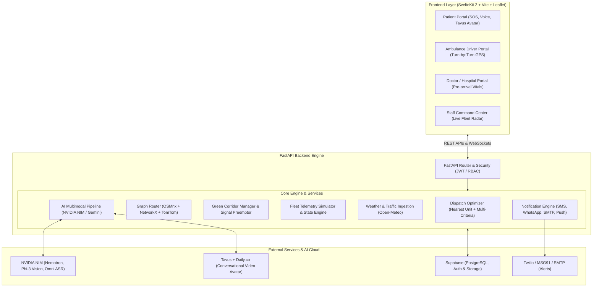

# 🚑 JEEVAN — Next-Gen AI Emergency Medical Dispatch & Green Corridor System

[](https://fastapi.tiangolo.com/)
[](https://kit.svelte.dev/)
[](https://tailwindcss.com/)
[](https://build.nvidia.com/)
[](https://supabase.com/)
[](https://leafletjs.com/)

> **JEEVAN** is an intelligent, full-stack Emergency Medical Services (EMS) dispatch, real-time fleet navigation, and dynamic **Green Corridor** coordination platform. Designed to maximize survival rates during the **Golden Hour**, JEEVAN combines multimodal AI triage, dynamic graph routing, automated traffic signal preemption, and specialized hospital matching into a unified command and control system.

---

## 🌟 Key Highlights & Features

### 1. 🧠 Multimodal AI Emergency Triage & Intake
- **AI Voice & Speech Recognition:** NVIDIA Nemotron-3 Omni ASR transcribe emergency voice calls in real-time.
- **Vision-based Medical OCR:** NVIDIA Phi-3 Vision extracts vital stats, diagnoses, and medical histories from user-uploaded photos of clinical reports, prescriptions, and ECGs.
- **Conversational Video Avatar:** Integrated **Tavus AI + Daily.co WebRTC** live video avatar conducts calming, structured conversational emergency patient intake.
- **Patient Health Assistant:** Everyday AI health guide providing contextual first-aid recommendations and rapid SOS escalation.

### 2. ⚡ Multi-Objective Dispatch Optimization
- **Rule & ML-Based Trauma Scoring:** Evaluates cardiac, stroke, pediatric, epilepsy, pregnancy, and trauma flags to assign clinical urgency levels (Level 1–5).
- **Traffic & Weather Aware Routing:** Adjusts fleet speeds, risk coefficients, and travel times based on real-time Open-Meteo precipitation data and TomTom / OSMnx road network graphs.
- **Golden Hour Hospital Matching:** Two-stage matching evaluates proximity vs. facility capabilities (e.g., Cath Lab for STEMI, Trauma Center Level 1, Stroke Unit, NICU, Burn Ward).

### 3. 🚦 Dynamic Green Corridor & Signal Preemption
- **Automated Virtual Corridors:** Computes real-time bounding corridors along the active ambulance route.
- **Signal Preemption Simulator:** Automatically overrides traffic signals ahead of high-priority ambulances.
- **Multi-Mission Conflict Resolution:** Dynamically arbitrates right-of-way when multiple ambulances approach intersecting paths based on clinical trauma levels.

### 4. 👥 Role-Based Portals (RBAC)
- **🚑 Ambulance Driver Portal:** Turn-by-turn navigation, patient medical summary, live telemetry broadcasting, and one-tap trip status updates (`En Route` ➔ `On Scene` ➔ `Transporting` ➔ `Complete`).
- **🏥 Hospital / Doctor Portal:** Pre-arrival telemetry alerts, incoming patient vitals, AI report summaries, and dynamic bed/ICU reservations.
- **🚨 Dispatch Command Staff Portal:** City-wide live radar map, active incident queue, manual override controls, and green corridor health diagnostics.
- **🩺 Patient / Bystander Portal:** One-click Emergency SOS, live GPS tracking of assigned ambulance with ETA countdown, first-aid instructions, and secure medical history locker.

### 5. 📑 Automated Post-Trip PCR (Patient Care Report)
- Generates comprehensive clinical handover reports upon trip completion for seamless hospital ED transfer.

---

## 🏛️ System Architecture



---

## 📂 Project Structure

```
sih-ambulancedispatch/
├── backend/                  # FastAPI Application
│   ├── app/
│   │   ├── api/              # API Route Controllers
│   │   │   ├── accounts.py   # Auth, OTP, Profile & Role Management
│   │   │   ├── ai.py         # AI Chat, Voice, Vision OCR & Tavus WebRTC
│   │   │   ├── hospitals.py  # Hospital Capacity & Specializations
│   │   │   └── tracking.py   # Dispatching, Fleet & Corridor Telemetry
│   │   ├── core/             # Configuration, DB & Security Middleware
│   │   ├── models/           # SQLAlchemy & Pydantic Data Models
│   │   ├── services/         # Core Domain Logic
│   │   │   ├── corridor.py   # Green Corridor & Signal Synchronization
│   │   │   ├── dispatch_optimizer.py # Multi-criteria Dispatch Engine
│   │   │   ├── fleet.py      # Ambulance Fleet State & Simulation
│   │   │   ├── graph_router.py # NetworkX & OSMnx Routing
│   │   │   ├── patient_care.py # Medical AI Analysis & PCR Generator
│   │   │   └── weather.py    # Live Weather Ingestion
│   │   └── main.py           # FastAPI Entrypoint & Lifespan Tasks
│   └── requirements.txt      # Python Dependencies
├── frontend/                 # SvelteKit 2 + Svelte 5 + Tailwind Frontend
│   ├── src/
│   │   ├── lib/              # Shared Components, Stores & Services
│   │   │   ├── api.ts        # Type-safe Backend REST Client
│   │   │   ├── supabase.ts   # Supabase Client Initialization
│   │   │   └── stores/       # Svelte Runes & State Stores
│   │   └── routes/           # App Routes & Role Views
│   │       ├── request/      # Patient Emergency SOS & Intake
│   │       ├── driver/       # Ambulance Navigation & Driver Controls
│   │       ├── doctor/       # Hospital Inbound Patient Dashboard
│   │       ├── staff/        # City-wide Fleet Dispatch Command
│   │       ├── ai-call/      # Tavus Live Video Avatar Intake
│   │       ├── ai-guide/     # Interactive First-Aid & Health AI
│   │       └── hospitals/    # Live Hospital Directory & Capacity
│   ├── package.json          # Frontend Dependencies & Scripts
│   └── vite.config.ts        # Vite Config with Dev API/WS Proxy
├── supabase_sql/             # PostgreSQL Schemas & Migrations
│   ├── profiles.sql          # User RBAC Profiles
│   ├── dispatches.sql        # Live & Historical Dispatch Records
│   ├── dispatch_cases.sql    # Emergency Intake Cases
│   └── medical_reports.sql   # Vision AI Analyzed Records
├── docker-compose.yml        # Multi-container Deployment Spec
├── README.md                 # Project Documentation
└── package.json              # Root Workspace Scripts
```

---

## 🛠️ Tech Stack

| Layer | Technology |
|---|---|
| **Backend Framework** | [FastAPI](https://fastapi.tiangolo.com/), [Uvicorn](https://www.uvicorn.org/), [Pydantic v2](https://docs.pydantic.dev/) |
| **Routing & Optimization** | [NetworkX](https://networkx.org/), [OSMnx](https://osmnx.readthedocs.io/), [scikit-learn](https://scikit-learn.org/), [OR-Tools](https://developers.google.com/optimization) |
| **AI & LLM Services** | [NVIDIA NIM](https://build.nvidia.com/) (Nemotron Mini/Nano, Phi-3 Vision, Nemotron Omni ASR), [Google Gemini](https://ai.google.dev/), [Tavus](https://www.tavus.io/) |
| **Frontend Framework** | [SvelteKit 2](https://kit.svelte.dev/) (Svelte 5 runes), [Vite 8](https://vitejs.dev/) |
| **Styling & UI** | [Tailwind CSS v4](https://tailwindcss.com/), [Lucide Svelte](https://lucide.dev/) |
| **Mapping & Telemetry** | [Leaflet.js](https://leafletjs.com/), HTML5 Geolocation, WebSockets |
| **Database & Auth** | [Supabase](https://supabase.com/) (PostgreSQL + RLS + Storage) with in-memory resilient fallback |
| **Communications** | [Twilio](https://www.twilio.com/) (SMS & WhatsApp), [MSG91](https://msg91.com/), SMTP, [Daily.co](https://www.daily.co/) (WebRTC) |

---

## 🚀 Getting Started

### Prerequisites
- **Node.js**: `v20+`
- **Python**: `3.11+`
- **npm** or **pnpm**
- (Optional) **PostgreSQL** or **Supabase** account

---

### Step 1: Clone the Repository
```bash
git clone https://github.com/Azmanshaikh/sih-ambulancedispatch.git
cd sih-ambulancedispatch
```

---

### Step 2: Environment Configuration
Copy the example environment file and configure your API keys:

```bash
cp .env.example .env
```

Key environment variables:
```env
# Server Configuration
PROJECT_NAME="JEEVAN"
CORS_ORIGINS="http://localhost:5173,http://localhost:3000"

# AI Services (NVIDIA NIM)
NVIDIA_API_KEY="nvapi-..."
NVIDIA_MODEL="nvidia/nemotron-mini-4b-instruct"
NVIDIA_VISION_MODEL="microsoft/phi-3-vision-128k-instruct"
NVIDIA_ASR_MODEL="nvidia/nemotron-3-nano-omni-30b-a3b-reasoning"

# Optional AI Fallback / Alternative
GEMINI_API_KEY="AIzaSy..."

# Tavus Conversational AI Avatar (Optional for Live Video Triage)
TAVUS_API_KEY="your_tavus_api_key"
TAVUS_PERSONA_ID="your_persona_id"
TAVUS_REPLICA_ID="your_replica_id"

# Supabase (Database & Auth)
VITE_SUPABASE_URL="https://your-project.supabase.co"
VITE_SUPABASE_ANON_KEY="your-anon-key"
SUPABASE_SERVICE_KEY="your-service-role-key"

# External Mapping & Weather
TOMTOM_API_KEY="your_tomtom_key"
GOOGLE_MAPS_API_KEY="your_google_maps_key"

# Emergency Alerts & Messaging (Optional)
TWILIO_ACCOUNT_SID="your_sid"
TWILIO_AUTH_TOKEN="your_token"
TWILIO_FROM="+1234567890"
MSG91_AUTH_KEY="your_msg91_key"
```

---

### Step 3: Database Setup (Supabase / Postgres)
If using Supabase, execute the SQL scripts in the **Supabase SQL Editor** in the following order:
1. `supabase_sql/profiles.sql` — RBAC schema and role enforcement.
2. `supabase_sql/dispatches.sql` — Active and archived fleet dispatch missions.
3. `supabase_sql/dispatch_cases.sql` — Emergency intake logs and triage histories.
4. `supabase_sql/medical_reports.sql` — OCR analysis records for patient health cards.

---

### Step 4: Installation & Running

#### Option A: Running with Root Scripts
```bash
# 1. Install all dependencies
pip install -r backend/requirements.txt
npm install && npm --prefix frontend install

# 2. Run backend (Port 8000)
npm run backend

# 3. In another terminal, run frontend (Port 5173)
npm run dev
```

#### Option B: Running via Docker Compose
```bash
docker-compose up --build
```

---

## 📡 API Reference Overview

The backend automatically hosts interactive Swagger documentation at **`http://localhost:8000/docs`**.

### Core Endpoints

| Category | Method | Endpoint | Description |
|---|---|---|---|
| **Tracking** | `POST` | `/tracking/dispatch` | Triggers multi-objective dispatch & green corridor calculation |
| **Tracking** | `GET` | `/tracking/fleet` | Returns real-time coordinates of all active ambulances |
| **Tracking** | `GET` | `/tracking/corridor` | Returns active green corridors and traffic signal states |
| **Tracking** | `WS` | `/tracking/ws/fleet` | WebSocket channel for real-time fleet GPS broadcasting |
| **AI** | `POST` | `/ai/chat` | Patient triage & first-aid consultation |
| **AI** | `POST` | `/ai/chat/voice` | Voice-based triage audio upload (NVIDIA ASR) |
| **AI** | `POST` | `/ai/analyze-report` | Multimodal medical report OCR & summary (NVIDIA Vision) |
| **AI** | `POST` | `/ai/tavus/start` | Initiates real-time conversational WebRTC video avatar intake |
| **Hospitals**| `GET` | `/hospitals/` | Real-time directory with bed, ICU, and specialty capacity |
| **Accounts** | `POST` | `/accounts/auth/login` | Authenticates users and issues role-scoped JWT tokens |

---

## 🛡️ License

Distributed under the **MIT License**. See `LICENSE` for more information.

---

## 👥 Contributors

Built with ❤️ for **Smart India Hackathon (SIH)** and next-generation emergency healthcare response.
